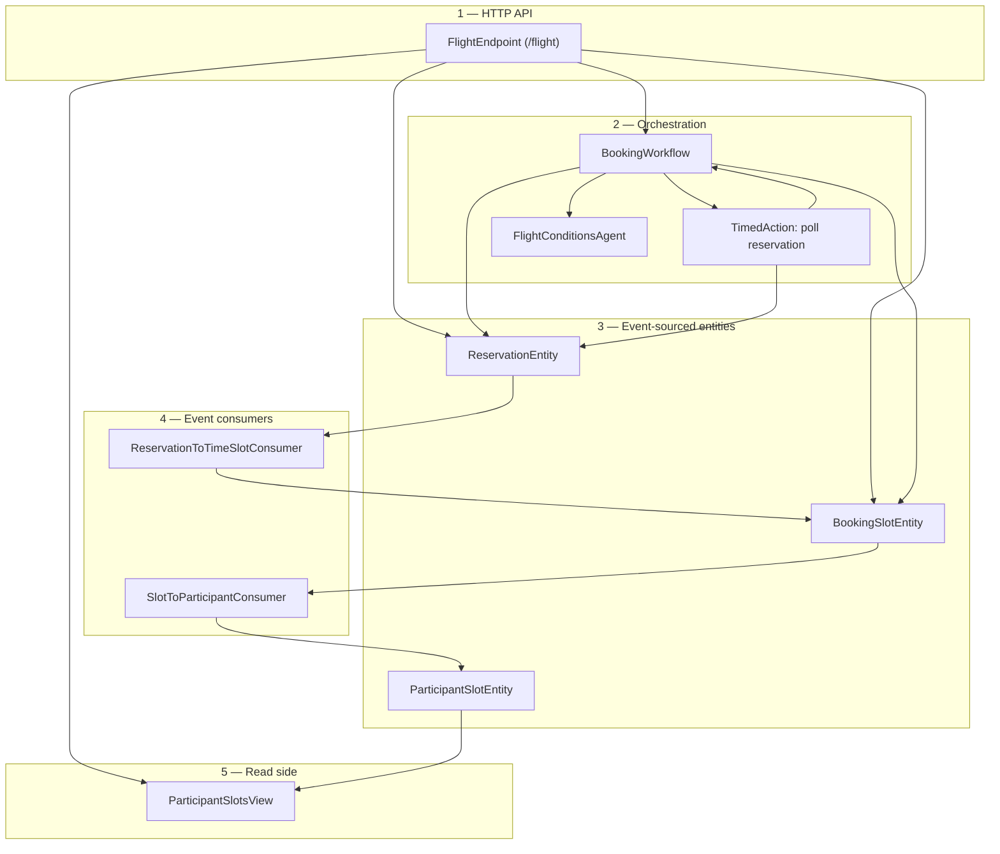
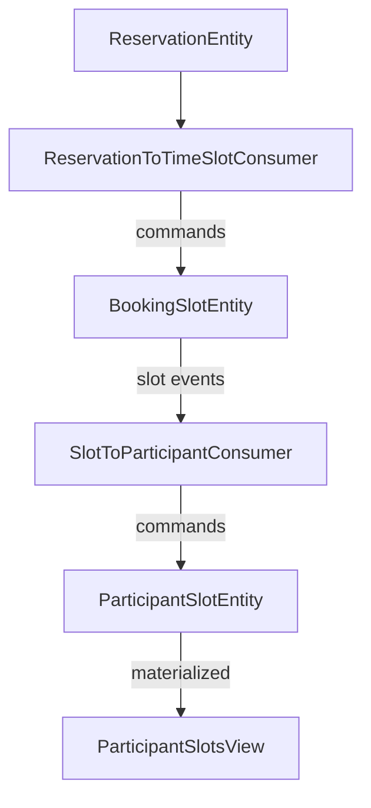
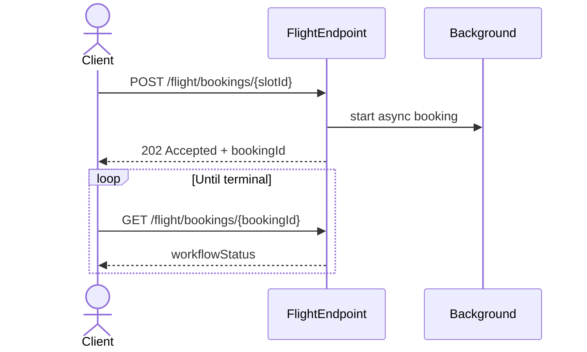
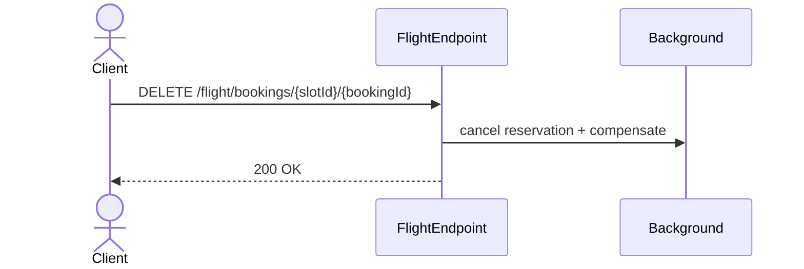
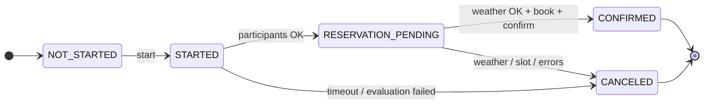

# Flight Training Scheduler — implementation notes

I mainly validated this against the diagrams and screenshots under [`images/`](images/) (flows, component map, ordering: mark availability → book → poll → cancel, idempotency). The official cert README covers the `/flight` contract and domain constraints; [`scripts/manual_api_flows.sh`](scripts/manual_api_flows.sh) is the repeatable check I run against a live service. No SSE for workflow progress—polling `GET` after `202` was enough for what we needed.

Stack is [Akka Java SDK](https://doc.akka.io/java/index.html): endpoints, entities, views, consumers, workflow, timers, agent. What follows is what actually shipped and what I deliberately kept thin for local/cert runs.

---

## Contents

| Section | What it covers |
|--------|----------------|
| [Quick start](#quick-start) | Build, run, smoke script |
| [API keys](#api-keys) | Gemini + OpenWeather (required env vars) |
| [Configuration](#configuration) | `application.conf`, env vars, timeouts |
| [Architecture](#architecture) | Layered diagrams + Akka components table |
| [HTTP API](#http-api-contract) | Endpoints and status codes |
| [Implementation notes](#implementation-notes) | Booking/cancel behavior, eventual consistency |
| [Diagrams](#diagrams) | Minimal sequence + numbered steps + workflow states |
| [Testing](#testing) | `mvn clean test` + manual script |
| [Local run evidence](#local-run-evidence-screenshots) | Screenshots (console + script) |

---

## Quick start

Build from the repo root (where `pom.xml` is—running Maven one level up gives “no POM”). Java 21, Maven 3.9+.

```bash
cd akka-dev-cert   # your clone folder
mvn clean package
```

Service listens on `http://localhost:9000`, base path `/flight`.

You need **API keys** in the environment before running (see [API keys](#api-keys)). Quick options:

- Copy [`.env.example`](.env.example) to `.env` in the repo root, fill in the two keys, then run [`scripts/run-local.sh`](scripts/run-local.sh) (it loads `.env` if present).
- Or export the same variables in your shell.

If Gemini hits quota (`429`), config can use a simulated fallback for local runs (`ALLOW_SIMULATED_QUOTA_FALLBACK`)—see [Configuration](#configuration).

```bash
bash scripts/run-local.sh
```

`run-local.sh` kills whatever is on port 9000 first—fine for your laptop, don’t use that blindly on a shared machine. Otherwise:

```bash
export GOOGLE_AI_GEMINI_API_KEY="…"
export OPENWEATHERMAP_API_KEY="…"
mvn compile exec:java
```

Against a running instance, from repo root:

```bash
bash scripts/manual_api_flows.sh
```

Expects GNU `date -d` (Linux/WSL/Git Bash). macOS stock `date` won’t cut it unless you tweak the slot variables. Poll/env tuning is all at the top of that script (`REQ-*` checks, waits for projections, etc.).

---

## API keys

The service reads **secrets from the environment**, not from the repo. Set these before `mvn compile exec:java` or `run-local.sh`:

| Variable | Used for |
|----------|-----------|
| `GOOGLE_AI_GEMINI_API_KEY` | Flight conditions agent (Gemini) |
| `OPENWEATHERMAP_API_KEY` | OpenWeather [Current Weather API](https://openweathermap.org/current) (default base URL in `application.conf`) |

Optional: `OPENWEATHER_LOCATION_QUERY`, `OPENWEATHER_BASE_URL`, `ALLOW_SIMULATED_QUOTA_FALLBACK`, `RESERVATION_EVALUATION_DEADLINE` — see [Configuration](#configuration).

### Google Gemini

1. Open [Google AI Studio — API keys](https://aistudio.google.com/app/apikey).
2. Sign in with your Google account.
3. Click **Create API key** (new or existing Google Cloud project).
4. Copy the key once and store it safely; add it to `.env` or your shell as `GOOGLE_AI_GEMINI_API_KEY`.

### OpenWeather

1. Open [OpenWeather weather APIs](https://openweathermap.org/api) and create a free account.
2. After login, use **API keys** in your account dashboard to generate a key.
3. Free tiers include products such as [Current Weather Data](https://openweathermap.org/current) and [5 Day / 3 Hour Forecast](https://openweathermap.org/forecast5); this project calls the configured weather endpoint with your key via `OPENWEATHERMAP_API_KEY`.

---

## Configuration

| Topic | Location / notes |
|--------|------------------|
| CORS | `akka.http.cors` — permissive (`*`) for local dev |
| Gemini agent | `akka.javasdk.agent.googleai-gemini` — `GOOGLE_AI_GEMINI_API_KEY`, model name |
| Flight agent + workflow | `flight-agent` — OpenWeather (`OPENWEATHERMAP_API_KEY`), `location-query`, `conditions-cache-ttl-seconds` |
| Workflow step wall time | `flight-agent.booking-workflow-step-timeout` (e.g. agent + HTTP can exceed SDK default) |
| Reservation evaluation deadline | `flight-agent.reservation-participant-evaluation-deadline` — max wait for all three participant accept/reject outcomes before workflow fails (`RESERVATION_EVALUATION_DEADLINE` env override) |
| Dev-only agent fallback | `flight-agent.allow-simulated-quota-fallback` — if `true`, Gemini **429 / quota** can yield a clearly marked simulated “safe” path so end-to-end runs still work (**disable for real use**); `ALLOW_SIMULATED_QUOTA_FALLBACK` |

---

## Architecture

First diagram is by layer. Second is one happy-path chain (reservation → consumer → slot → participant rows → view); it doesn’t mirror every HTTP route.

**1 — Layers**



**2 — Happy-path chain (events and commands)**

Simplified flow: reservation emits events; the consumer drives the slot; slot events drive per-participant rows; the view answers queries by `participantId`.



Workflow + reservation poll timer sit between HTTP and those boxes—I left them off diagram 2 so it stays readable.

### Akka SDK components (as registered)

| Class | SDK role | `@Component` / entry id | Responsibility |
|--------|-----------|--------------------------|----------------|
| `FlightEndpoint` | HTTP Endpoint | `@HttpEndpoint("/flight")` | Validates input, maps 200/202/400/404, drives workflow/reservation/slot/view |
| `BookingSlotEntity` | Event-sourced entity | `booking-slot` | Per-`slotId` truth: availability, bookings, cancel/unmark rules |
| `ParticipantSlotEntity` | Event-sourced entity | `participant-slot` | Per `slotId-participantId`; status + ingestion dedupe by sequence |
| `ParticipantSlotsView` | View | `view-participant-slots` | Query by `participantId` + `available` \| `booked` \| `canceled` |
| `ReservationEntity` | Event-sourced entity | `reservation` | Per-`bookingId` saga |
| `SlotToParticipantConsumer` | Consumer | `booking-slot-consumer` | `BookingSlotEntity` events → commands on `ParticipantSlotEntity` |
| `ReservationToTimeSlotConsumer` | Consumer | `reservation-to-timeslot-consumer` | `ReservationEntity` events → slot verify/mark/cancel coordination |
| `BookingWorkflow` | Workflow | `booking-workflow` | Steps: reservation → weather → book → confirm / cancel paths |
| `BookingReservationPollTimedAction` | Timed action | `booking-reservation-poll` | Timers polling reservation completion; resumes workflow |
| `FlightConditionsAgent` | Agent | `flight-conditions-agent` | OpenWeather-grounded suitability check (`FlightConditionsAgent` implementation) |

Domain lives under `io.example.domain`; persisted events use `@TypeName` where it matters for the journal.

More notes per folder: [`src/main/java/io/example/application/README.md`](src/main/java/io/example/application/README.md).

---

## HTTP contract

| Method | Path | Typical success |
|--------|------|-----------------|
| `POST` | `/flight/availability/{slotId}` | 200 — mark participant available |
| `DELETE` | `/flight/availability/{slotId}` | 200 — unmark (body: participant id + type) |
| `GET` | `/flight/availability/{slotId}` | 200 — `{ bookings, available }` |
| `POST` | `/flight/bookings/{slotId}` | **202** (async) or **200** when already confirmed (`alreadyConfirmed`) |
| `GET` | `/flight/bookings/{bookingId}` | 200 poll until `terminal`; 404 if never started |
| `DELETE` | `/flight/bookings/{slotId}/{bookingId}` | 200 idempotent; 404 / 400 for unknown or slot mismatch |
| `GET` | `/flight/slots/{participantId}/{status}` | 200 — `status` ∈ `available` \| `booked` \| `canceled` |

Errors are plain text, not Problem Details. Full matrix is in Javadoc on `FlightEndpoint`.

---

## Implementation notes

### `BookingSlotEntity` (entity id = slot key, e.g. `YYYY-MM-DD-HH`)

Commands exposed to the SDK/workflow:

- `markSlotAvailable` / `unmarkSlotAvailable` — idempotent no-ops when already in that state
- `bookSlot` (`BookReservation`) — needs student, aircraft, instructor all waiting or it throws `SlotNotBookableException`. Persists three `ParticipantBooked` events (student → aircraft → instructor). Idempotent once that `bookingId` already has three rows.
- `cancelBooking` — strips all rows for a `bookingId` (up to three cancel events)
- `cancelTimeSlot` — cancel plus unmark anyone still “waiting” who wasn’t part of that booking
- `getSlot` — current `Timeslot`
- `verifyParticipantTimeslotRequest` — gate used from `ReservationToTimeSlotConsumer` before marking from the saga

Persisted events (`BookingEvent`; console shows `@TypeName`):

| Console / `@TypeName` | Java record | State change |
|----------------------|-------------|----------------|
| `slot-reserved` | `ParticipantMarkedAvailable` | Add one participant to `available` |
| `slot-unreserved` | `ParticipantUnmarkedAvailable` | Remove from `available` |
| `reservation-booked` | `ParticipantBooked` | Remove that participant from `available`; add one `(participant, bookingId)` to `bookings` |
| `booking-participant-canceled` | `ParticipantCanceled` | Drop all `bookings` rows for that `bookingId` |

State is two sets (`available`, `bookings`). The console renders them as arrays with no stable order—diff noise that only permutes rows usually isn’t a semantics bug; look at membership, not index.

Before confirm you’ll normally see three `slot-reserved` lines (three marks), then three `reservation-booked` lines from one successful `bookSlot`—often stamped in the same second.


- `POST /flight/bookings` returns `202`; clients poll `GET /flight/bookings/{bookingId}` until `terminal`. Work happens off the request thread so we’re not holding HTTP open across the saga.

- Participant slots/views lag a bit—the script uses waits/polls so `REQ-*` doesn’t flake on eventual consistency.

- `ReservationToTimeSlotConsumer` won’t call `markSlotAvailable` again if that participant is already booked for this reservation on the slot (covers duplicate delivery and weird ordering vs `bookSlot`).

- Cancels keep participant-slot rows as `canceled` instead of pretending they never existed.

---

## Diagrams

Thin HTTP-only sequence below; “background” is shorthand for workflow + reservation + slot + consumers + timer + agent. The numbered list is the actual order after `202`.

### Async booking — minimal sequence + steps



After `202` on the happy path:

1. `BookingWorkflow` creates `ReservationEntity` for student / aircraft / instructor on that slot.
2. `BookingReservationPollTimedAction` polls the reservation until all three requests are resolved or the deadline hits.
3. `ReservationToTimeSlotConsumer` drives verify/mark/cancel on `BookingSlotEntity` from reservation events.
4. `FlightConditionsAgent` runs the weather gate; fail → workflow `CANCELED`.
5. Pass → `bookSlot` on `BookingSlotEntity`, then confirm on the reservation.
6. Slot events fan out via `SlotToParticipantConsumer` into `ParticipantSlotEntity`; the view updates async (scripts poll).

### Cancel booking — minimal sequence + steps



1. `FlightEndpoint` calls `ReservationEntity.cancel` (slot id must match booking).
2. Reservation emits cancel/compensation; `ReservationToTimeSlotConsumer` fixes up the slot.
3. `BookingSlotEntity` emits cancel-related events; `SlotToParticipantConsumer` moves participant slots to `canceled` in the projection (different shape than raw `Timeslot`—see notes above).

### `BookingWorkflow` states (summary)

Rough sketch—enum names in code are authoritative. `CONFIRMED` / `CANCELED` are terminal; client sees outcome via polling `GET` until `terminal`.



---

## Testing

```bash
mvn clean test
```

```bash
bash scripts/manual_api_flows.sh
```

(Point `BASE_URL` at your service if not localhost:9000.)

---

## Local run evidence (screenshots)

Stuff I grabbed while debugging—console components, agent trace, workflows, script summary. Paths under [`docs/screenshots/`](docs/screenshots/).

**Components** (`localhost:9000`, service Ready):


**Flight conditions agent** (tool `getWeatherForecast` + final `ConditionsReport` JSON):


**Booking workflows** (CONFIRMED and CANCELED runs):


**Manual API script** (`bash scripts/manual_api_flows.sh`, all `REQ-*` PASS):


